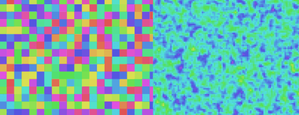
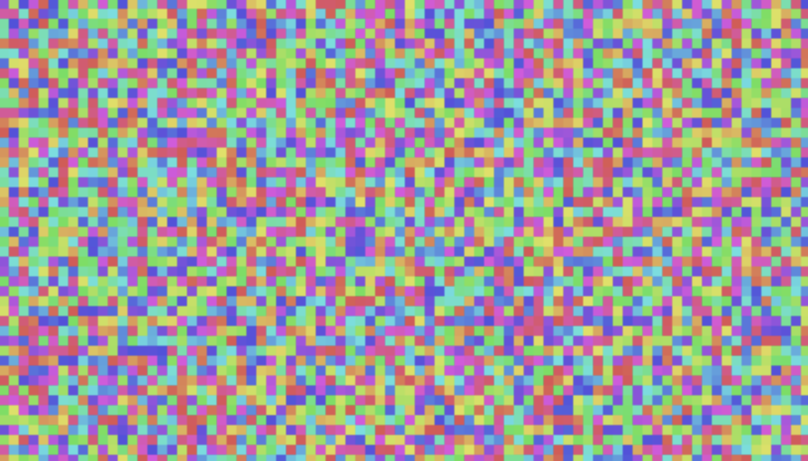
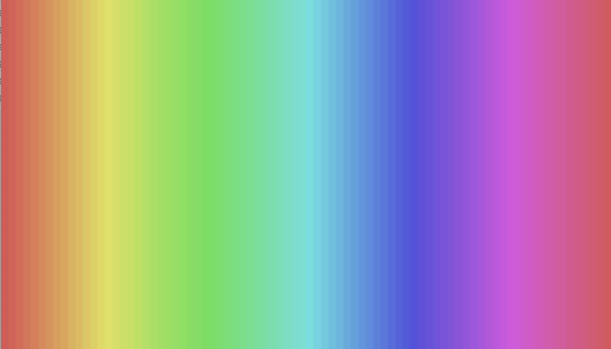

# 🍦 Vanilla JS Cellular Automata

In this lesson we're going to setup a single file vanilla HTML/JS coding environment that you can run locally, and deploy on free static hosting sites like [CodePen](https://codepen.io/your-work). 

We'll also setup a basic HTML canvas grid based visualization.



This will serve as a useful template for creating cellular automata based simulations, but more broadly show you what it takes to put pixels on a computer screen. That way when we use frameworks like [Pixi](https://pixijs.com/), [P5](https://p5js.org/), or [ThreeJS](https://threejs.org/) we'll understand a bit about the fundamental pipeline they all go through. 

----

**1. Install VS Code**

https://code.visualstudio.com/

**2. Create & run a basic HTML / JS file**

- Create a file anywhere on your computer named `vanilla.html`
- Open it in VS Code
- Type in the following code:

```html
<!DOCTYPE html>
<html>
<head>
    <meta charset="UTF-8" />
    <title>Vanilla JS</title>
</head>
<body>
    <p>Hello!</p>
    <script>
        console.log("Hello world!")
    </script>
</body>
</html>
```

- Double click the file or drag & drop it into your browser

If everything worked, you should see the text on screen, and the console text in the browser console:


> **Challenge:** Can you make the web page display the current time? 
>
> You want to (1) get the current time in the JS code (2) Use `document.querySelector()` to select the HTML element and edit it with the local time (3) use `setInterval` to auto-update the code

**3. Add a canvas and draw a rectangle**

- Add a canvas element inside the `<body>` tag:

```html
<canvas></canvas>
```

- Add the following CSS style tag inside the `<head>` tag 

```html
<style>
html, body {
    margin: 0px; overflow: hidden;
}
</style>
```

- Remove the `<p>Hello</p>` tag
- Add the following JS code in the script tag:

```js
const canvas = document.querySelector("canvas");
canvas.width = window.innerWidth;
canvas.height = window.innerHeight;
const ctx = canvas.getContext("2d");

ctx.fillRect(25, 25, 20, 20);
```

Refresh the page - you should now see a black rectangle.

The complete code you should have so far: [vanilla-1.html](../code/vanilla-1.html)

> **Challenge:** Can you make the rectangle red?
>
> The [MDN canvas docs](https://developer.mozilla.org/en-US/docs/Web/API/Canvas_API/Tutorial) are a good reference.
>
> **Challenge:** Can you draw a circle instead of a rectangle?

**4. Make the rectangle move**

Here we're going to introduce a loop that clears & redraws the scene every frame.

- Add a loop function (runs 60 times per second)

```js
function loop() {
    requestAnimationFrame(loop)

    console.log(Date.now()) // prints current time in milliseconds
}
loop()
```

- Create a variable that increments every frame

```js
let count = 0 // create the variable
function loop() {
    requestAnimationFrame(loop)

    count += 1 // increment by 1 every loop
    ctx.clearRect(0, 0, canvas.width, canvas.height)
    ctx.fillRect(count, 25, 20, 20) // draw the rectangle at a variable x
}
loop()
```

You should now see the rectangle moving to the right.

- Make the rectangle go back & forth by taking the sine of the count variable

```js
// inside the loop function
count += 0.1 // make this go slower
const x = Math.sin(count) * 50 + 150
ctx.fillRect(x, 25, 20, 20) // make this `x` instead of `count`
```


> **Challenge:** Can you make it move in a circle, not just go back and forth on the x axis?
>
> Hint: try making it go back and forth on the y axis first

**5. Deploy your code**

- Make an account on https://codepen.io/
- Create a new "pen"
- Copy/paste your code into the "HTML" section of the CodePen interface
- Click "Save" in the top right
- To share it, click on the little icon of an arrow going out of a box, in the bottom right (on the same row as "Share" / "Export" / "Embed")

The shared link should look like this: https://codepen.io/omarshe7ta/full/wBWBqZq

This is the fastest way to go from code on your computer to code on the internet. This is "infinitely scalable" in that it can run on a billion computers overnight and it will cost nothing (because the code is running on people's computers, not a centralized server).

The drawback to CodePen is that it has their banner at the top of the page. Later we'll setup deploys with GitHub Pages which lets you have full control over the page. 

From here you can keep coding in your local file or in the CodePen.

**6. Setup the grid**

Instead of drawing one rectangle, we're going to fill the screen with rectangles of different colors. 

We're going to define three new functions: (1) `initGrid()` stores the color for every square we want on screen. (2) `drawGrid()` takes whatever colors are currently stored, and draws them in the right location. (3) `updateGrid()` takes the current color at each pixel and computes a new one.

This structure we're setting up is kind of similar to what happens on the GPU, but we're doing it on the CPU. There's a fun [Mythbusters video here](https://www.youtube.com/watch?v=ZrJeYFxpUyQ) depicting a good intuition for GPU vs CPU. The "write a function to compute the new color at every pixel" is how [all the effects on ShaderToy](https://www.shadertoy.com/) are made.

Here are the 3 functions, including how they are called inside the `loop` function:

```js
const grid = {}
const gridSize = 5
initGrid()

function loop() {
    requestAnimationFrame(loop)

    updateGrid()
    drawGrid()
}
loop()

function initGrid() {
    // Fill the grid data structure with initial random colors
    for (let x = 0; x < canvas.width; x+= gridSize) {
        for (let y = 0; y < canvas.height; y+= gridSize) {
            const color = Math.random() * 360
            grid[`${x}_${y}`] = color
        }
    }
}

function updateGrid() {
    for (let x = 0; x < canvas.width; x+= gridSize) {
        for (let y = 0; y < canvas.height; y+= gridSize) {
            let currentColor = grid[`${x}_${y}`]
            // modify the color of the current square
            // given the color it currently has
            grid[`${x}_${y}`] = currentColor
        }
    }
}

function drawGrid() {
    // draw whatever is currently stored in the grid variable
    for (let x = 0; x < canvas.width; x+= gridSize) {
        for (let y = 0; y < canvas.height; y+= gridSize) {
            const color = grid[`${x}_${y}`]
            ctx.fillStyle = `hsl(${color}, 70%, 60%)`;
            ctx.fillRect(x, y, gridSize, gridSize);
        }
    }
}
```

You should see a colorful grid that is NOT moving.



The complete code at this point: [vanilla-2-grid.html](../code/vanilla-2-grid.html)

- To make it move, edit the `updateGrid()` function. Instead of:

```js
grid[`${x}_${y}`] = currentColor
```

Make it `currentColor + 1`. This will make each square cycle through the color wheel, relative to wherever it started from.

> **Challenge:** instead of random initial colors, can you make the screen be a smooth rainbow from left to right?
>
> What about just making HALF of the screen be a rainbow, and the other half be a random mix of colors?



> **Challenge:** can you make the grid of pixels "flow" ?
> 
> Hint: this requires you to get not just the "current color" of the current pixel, but the neighboring pixels. The simplest flow is to get the color from the pixel to the left and set it to the current pixel.
